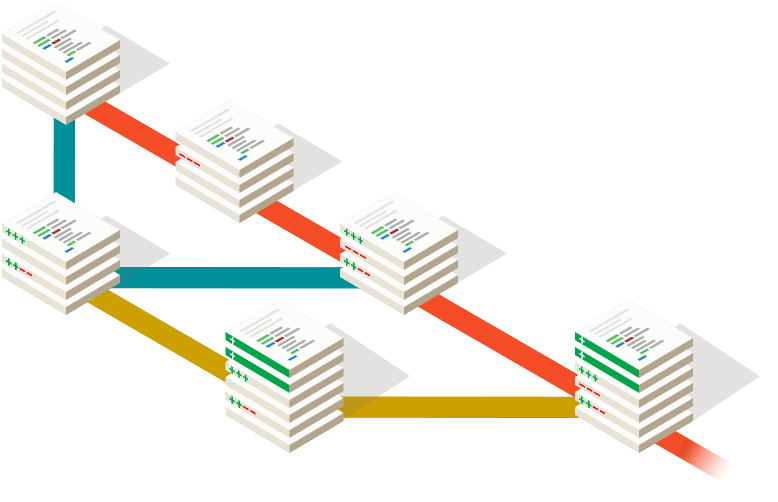

% Introduction au versionnement
% David Sferruzza

# À propos de moi

- [\@d_sferruzza](https://twitter.com/d\_sferruzza)
- [github.com/dsferruzza](https://github.com/dsferruzza)
- développeur et responsable R&D chez [Escale](http://www.escaledigitale.com)
- utilise quotidiennement des outils de versionnement
- connaît la douleur de travailler sans de tels outils

# Créer

> La créativité est un processus mental impliquant la génération de nouvelles idées ou concepts, ou de nouvelles associations entre des idées et des concepts préexistants.

Le processus de création présente des similarités intéressantes, qu'on crée :

- un programme informatique
- un morceau de musique
- un livre sur les pokémons
- les plans d'une fusée...

# Meet Jebediah Kerman

...qui sera notre exemple pour cette présentation !

# Meet Jebediah Kerman

Jebediah Kerman veut **créer** une fusée pour attendre l'orbite de sa planète, et revenir au sol en un seul morceau !

# Meet Jebediah Kerman

Avant de réussir, il va probablement échouer, et recommencer.

# Meet Jebediah Kerman

Encore.

# Meet Jebediah Kerman

Et encore.

# Meet Jebediah Kerman

À chaque fois, il devra améliorer ou ajuster le plan de sa fusée.
En pratique, c'est loin d'être simple :

- manipuler un document complexe
- faire beaucoup de petites modifications et tester
- changer d'avis et revenir en arrière
- tester des modifications structurelles importantes

Tout ça en collaboration avec *Wernher von Kerman*, le célèbre ingénieur !

# Représentation

On ne va pas versionner directement ce qu'on veut créer, mais une **représentation**.
Cette représentation doit nous permettre de **construire** de façon *suffisamment reproductible* ce qu'on veut créer.

--------------------  --------------------  --------------------
Représentation        Construction          Résultat
--------------------  --------------------  --------------------
code source           compilation           programme

partition             interprétation        musique

plans de fusée        assemblage            fusée
--------------------  --------------------  --------------------

Créer va donc se concrétiser par des **évolutions de la représentation**.

# Versionnement

Le versionnement, c'est la **journalisation** des évolutions de la représentation.

On peut imaginer une sorte de *timeline* où chaque nœud représente une modification :

# Git

Git s'occupe de tenir le journal des évolutions à la place du créateur (ou plutôt il l'aide beaucoup).

Git fonctionne avec n'importe quelles représentations sous forme d'**arborescences de fichiers**.

<https://git-scm.com/>

Regardons ses concepts de base...

# Commit

Le créateur va faire évoluer la représentation.
Lorsqu'il atteint un état qui lui convient, il va enregistrer au sein d'un **commit** les modifications qu'il a effectuées.

- référence du commit parent *(sauf pour le 1er)*
- date et heure
- auteur
- contenu de la modification
- commentaire explicatif

Un commit stocke les **changements** par rapport à l'état du commit parent. *Il ne stocke **pas** le nouvel état.*

# Branche

La *timeline* des commits peut diverger ou converger.
Chaque divergence est représentée par une **branche** :

Les branches permettent, entre autres, de :

- faire des essais en isolation
- rendre l'historique plus lisible, en groupant des commits
- faciliter la collaboration entre personnes

# Avantages

Git permet de :

- **versionner sa création**, sans pour autant interférer trop lourdement dans le processus de création
- **travailler à plusieurs** sur la même chose, sans avoir besoin d'être toujours connecté
- **naviguer dans l'historique**, et obtenir la représentation telle qu'elle était à n'importe quel moment
- **retrouver** quelle modification a introduit un comportement donné, et qui l'a faite
- ...

# Applications

Git a été fait pour gérer des codes source de programme, mais son modèle a beaucoup de sens dans plein d'autres situations.

Voici quelques exemples où Git est utilisé pour versionner :

- le code civil français <small><https://github.com/steeve/france.code-civil></small>
- Git <small><https://github.com/git/git></small>
- cette présentation <small><https://github.com/dsferruzza/talk-introduction-versionnement></small>

# Conclusion

- le versionnement c'est l'écriture de **l'histoire des évolutions** de votre projet
- Git est puissant, et pertinent dans pas mal de situations

> La prochaine fois que vous créerez quelque chose, demandez-vous si ça vaut le coup de le versionner !

# Questions ?

Twitter : \@d_sferruzza

Slides sur GitHub :

[dsferruzza/talk-introduction-versionnement](https://github.com/dsferruzza/talk-introduction-versionnement)

